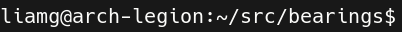

# :compass: bearings

A fast, clean, super-customisable shell prompt.

- Supports zsh, bash, fish, and more.
- Easily write your own modules using any language.
- Simple configuration with YAML - works out of the box with a sensible default configuration too.

## Examples Gallery

<table>
    <tr><td></td><td align="center"><a href="_examples/default/config.yml">Default</a></td></tr>
    <tr><td></td><td align="center"><a href="_examples/halflife/config.yml">Half Life</a></td></tr>
    <tr><td></td><td align="center"><a href="_examples/traditional/config.yml">Traditional</a></td></tr>
    <tr><td></td><td align="center"><a href="_examples/fire/config.yml">Fire</a></td></tr>
    <tr><td></td><td align="center"><a href="_examples/ukraine/config.yml">Ukraine</a></td></tr>
    <tr><td></td><td align="center"><a href="_examples/pirate/config.yml">Pirate</a></td></tr>
    <tr><td></td><td align="center"><a href="_examples/wasteland/config.yml">Wasteland</a></td></tr>
    <tr><td></td><td align="center"><a href="_examples/hive/config.yml">Hive</a></td></tr>
</table>

## Installation

You can download the latest binaries [here](https://github.com/liamg/bearings/releases/latest). Make sure you `chmod +x`  the binary and place it somewhere in your `PATH`. Then follow the instructions for your shell below.

It is recommended to install font(s) which include powerline characters, especially [nerd-fonts](https://github.com/ryanoasis/nerd-fonts).

## Configuration

### Automatic (recommended)

You can automatically configure your shell by running `bearings install`. This will modify your shell configuration files in order to set bearings as your PS1 generator. For advanced configurations (e.g. templated dotfiles), you should use the manual methods below. It's always a good idea to back up your config files first!

If you'd like to install bearings to a shell other than the one you're using, you can specify it with the `-s/--shell` flag, e.g. `bearings install -s fish`.

### ZSH

```zsh
#bearings-auto:start
function preexec() {
  btimer=$(($(date +%s%0N)/1000000))
}
function configure_bearings() {
    last=$?
    elapsed=0
    if [ $btimer ]; then
      now=$(($(date +%s%0N)/1000000))
      elapsed=$(($now-$btimer))
      unset btimer
    fi
    PROMPT="$(bearings prompt -s zsh -e ${last} -d ${elapsed} -j $(jobs | wc -l))"
}
[ ! "$TERM" = "linux" ] && precmd_functions+=(configure_bearings)
#bearings-auto:end
```

### Bash

```bash
#bearings-auto:start
PS0='$(echo "$(($(date +%s%N)/1000000))" > /tmp/bearings.$$)';
bearings_prompt() { 
    NOW=$(($(date +%s%N)/1000000))
    START=$NOW
    [[ -f /tmp/bearings.$$ ]] && START=$(cat /tmp/bearings.$$) && rm /tmp/bearings.$$
    DURATION=$(($NOW - $START));
    export PS1=$(bearings prompt -s bash -e $? -d $DURATION -j $(jobs -p | wc -l)); 
}
[[ ! "$TERM" = "linux" ]] && export PROMPT_COMMAND=bearings_prompt
#bearings-auto:end
```

### Fish

```fish
#bearings-auto:start
function fish_prompt
    bearings prompt -s fish -e $status -d $CMD_DURATION -j (count (jobs -p))
end
#bearings-auto:end
```

## Customisation

The config file is read from `~/.config/bearings/config.yml`. You can create a default config file by running `bearings prompt` for the first time.

For completeness, here is the default config file:

```yaml
padding: 1
end: 
divider: 
fg: white
bg: black
lines_above: 1
modules:
- failure_bg: '#bb4444'
  failure_fg: '#ffffff'
  show_success: true
  success_bg: '#000000'
  success_fg: '#ffffff'
  success_output: 
  type: exitcode
- bg: '#334488'
  fg: '#aaaaaa'
  label:  %s
  max_depth: 3
  type: cwd
- bg: '#393939'
  fg: '#777777'
  type: git
```

You can find example configurations with screenshots for each in the [examples directory](_examples).

| Property    | Default                 | Description                                                                            |
|-------------|-------------------------|----------------------------------------------------------------------------------------|
| padding     | 1                       | Number of spaces before and after each module. Can be overriden on a per-module basis. |
| end         |  (powerline character) | The string to render at the end (right) of the prompt.                                 |
| divider     |  (powerline character) | The string to render between modules. Can be overriden on a per-module basis.          |
| fg          | white                   | Default foreground colour for all modules. Can be overridden on a per-module basis.    |
| bg          | black                   | Default background colour for all modules. Can be overridden on a per-module basis.    |
| lines_above | 1                       | Number of blank lines to render above the prompt.                                      |
| modules     | exitcode, cwd, git      | A list of modules and their configurations.                                            |

Colours can be specified in hexadecimal, e.g. `#ffffff`. You can also refer to your terminal colour scheme colours using `default` (for default fg/bg), `red`, `green`, `yellow`, `blue`, `magenta`, `cyan`, `white`, `black`, `lightred`, `lightgreen`, `lightyellow`, `lightblue`, `lightmagenta`, `lightcyan`, `lightwhite`, `lightblack`

All modules support the following options:

| Property       | Default                           | Description                                                                                                                    |
|----------------|-----------------------------------|--------------------------------------------------------------------------------------------------------------------------------|
| label          | %s                                | Text to render alongside the module output. Use %s as the placeholder for the module content.                                  |
| fg             | _inherits from top-level fg_      | Module foreground colour.                                                                                                      |
| bg             | _inherits from top-level bg_      | Module background colour.                                                                                                      |
| padding_before | _inherits from top-level padding_ | Number of spaces to output before the module content.                                                                          |
| padding_after  | _inherits from top-level padding_ | Number of spaces to output after the module content.                                                                           |
| divider        | _inherits from top-level divider_ | Divider string to output after the module, to separate it fro mthe next module. If there is no next module, will not be shown. |
 | bold           | false                             | Turns on bold text.                                                                                                            |
| italic         | false                             | Turns on italic text.                                                                                                          |
| faint          | false                             | Turns on faint text.                                                                                                           |
| underline      | false                             | Turns on underlined text.                                                                                                      |

## Available Modules

### Current Working Directory (`cwd`)

Show the current working directory.


| Property           | Default                   | Description                                                                                                                                                                               |
|--------------------|---------------------------|-------------------------------------------------------------------------------------------------------------------------------------------------------------------------------------------|
| max_depth          | 0                         | The maximum number of directories to render in the path. If this number is exceeded, the output will be truncated to show `...` followed by the lowest `max_depth` number of directories. |
| separator          |                          | The string to separate directories with.                                                                                                                                                  |
 | separator_fg       | _inherits from module fg_ | Foreground colour of the separator.                                                                                                                                                       |
 | deep_prefix        |                          | Output to prefix the path with when the max depth is reached.                                                                                                                             |
 | home_text          | ~                         | Text to represent home directory.                                                                                                                                                         |
 | separator_at_start | false                     | Show the separator at the start of the path.                                                                                                                                              |

### Exit Code (`exitcode`)

Show the exit code of the previous command. By default will only show when the command fails, but can also show a success icon/message.


| Property       | Default                          | Description                                                            |
|----------------|----------------------------------|------------------------------------------------------------------------|
| show_success   | false                            | Show the module when the previous command succeeded (exit code zero).  |
| success_bg     | _inherits from bg, top-level bg_ | Background colour for the module when the previous command succeeded.  |
| failure_bg     | _inherits from bg, top-level bg_ | Background colour for the module when the previous command failed.     |
| success_fg     | green                            | Foreaground colour for the module when the previous command succeeded. |
| failure_fg     | red                              | Foreground colour for the module when the previous command failed.     |
| success_output |                                 | Output for the module when the previous command succeeded.             |
| failure_output |                                 | Output for the module when the previous command failed.                |

### Git Overview (`git`)

Show an overview of the current git status. Displays the branch name, a set of possible icons, and the number of commits ahead/behind of the base branch.

| Property       | Default   | Description                                                  |
|----------------|-----------|--------------------------------------------------------------|
| icon_stashed   | S         | The icon/text to display when stashed changes are available. |
| icon_untracked | ?         | The icon/text to display when untracked files are present.   |
| icon_modified  | M         | The icon/text to display when tracked files are modified.    |
| icon_staged    | A         | The icon/text to display when changes are staged.            |
| icon_conflicts | !         | The icon/text to display when conflicts are present.         |
| clean_bg       | _inherit_ | Background colour when there are no changes.                 |
| clean_fg       | _inherit_ | Foreground colour when there are no changes.                 |
| dirty_bg       | _inherit_ | Background colour when there are changes.                    |
| dirty_fg       | _inherit_ | Foreground colour when there are changes.                    |

### Command (`command`)

Run a shell command and use the combined output streams as the module output.

| Property | Default | Description               |
|----------|---------|---------------------------|
| command  | _none_  | The shell command to run. |

### Duration

Shows the duration of the previous shell command. Can be configured to only show duration when over a certain threshold.


| Property  | Default | Description                             |
|-----------|---------|-----------------------------------------|
| threshold | 3s      | Show duration when over this threshold. |

### Jobs

Shows the number of background jobs (if > 0).

### Hostname (`hostname`)

Show the current hostname.

### Languages

Show icons for discovered languages/technologies in the current directory.

| Property  | Default | Description                      |
|-----------|---------|----------------------------------|
| separator | <space> | The separator between the icons. |

### New line (`newline`)

Output a single new line. Before/after padding values default to `0` for convenience.

### Text (`text`)

Output the specified text.

| Property | Default | Description         |
|----------|---------|---------------------|
| text     | _none_  | The text to output. |

### Username (`username`)

Show the current username.
